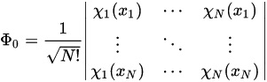

The GHF library can be used to run RHF, UHF and GHF calculations. We have provided an interactive IPython Notebook that illustrates the API of the library . For local installations, please refer to the [documentation](INSTALL.md)

